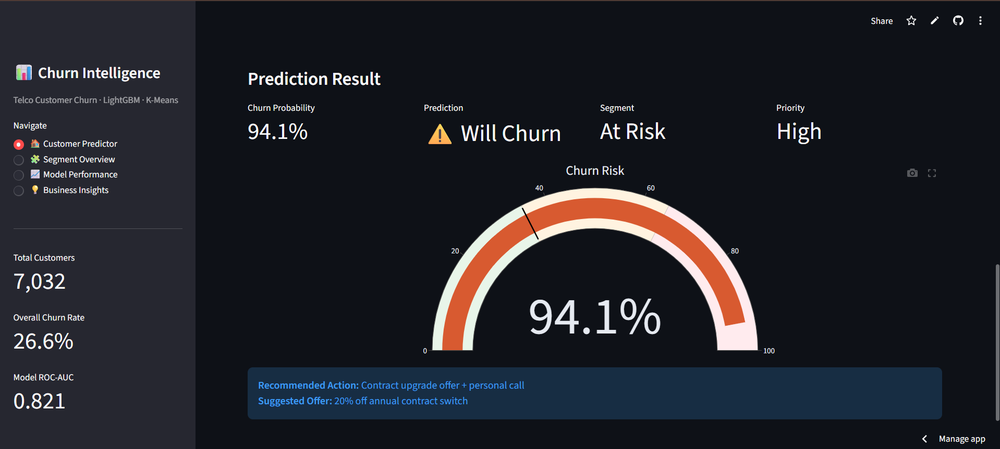
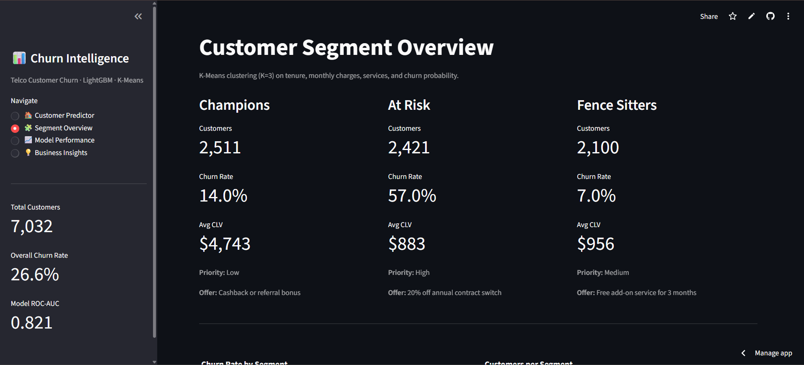
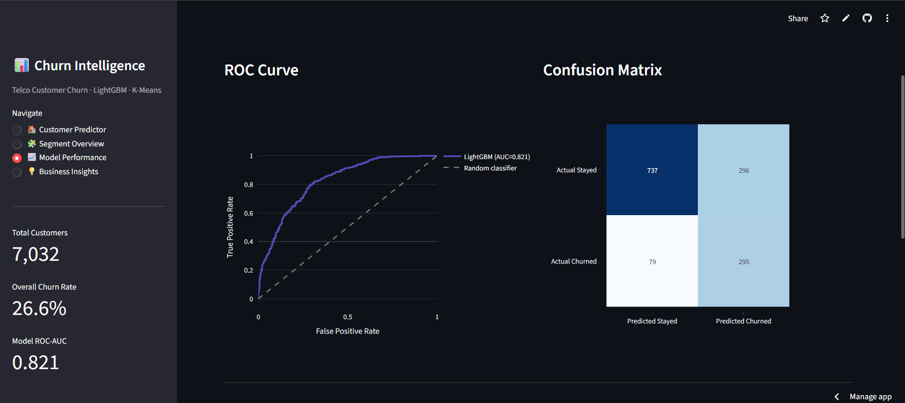
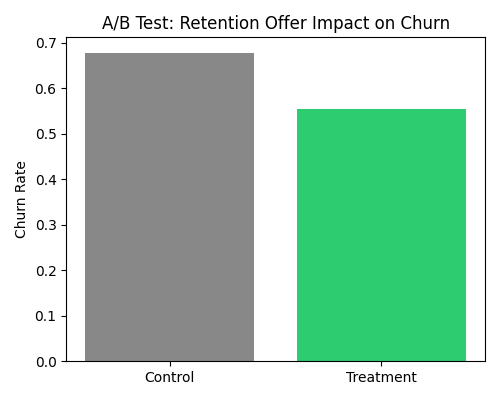

# Customer Churn Intelligence Platform

An end-to-end machine learning project that predicts customer churn for a telecom
company, segments customers into actionable groups, and recommends targeted
retention offers — built on the Telco Customer Churn dataset.

**[Live Dashboard](http://13.53.185.209/churn/)**

---

## Dashboard Preview

**Customer Churn Predictor — Live Prediction**


**Customer Segments Overview**


**Model Performance — ROC Curve & Confusion Matrix**


**A/B Test Simulation — Retention Offer Impact**


---

## Overview

Telecom companies lose significant revenue to customer churn. This project builds
a complete pipeline — from raw data to a deployed, interactive dashboard — that:

- Predicts the probability that any given customer will churn
- Explains *why* using SHAP feature importance
- Segments all customers into 3 actionable personas using K-Means
- Recommends a specific retention offer per customer based on their segment
- Simulates an A/B testing framework to demonstrate how retention interventions
  would be statistically validated against a control group

| Metric | Score |
|---|---|
| ROC-AUC | 0.821 |
| F1 Score (threshold = 0.35) | 0.611 |
| Churn Recall | 79% |
| Overall Accuracy | 73% |

---

## Dataset

[Telco Customer Churn — Kaggle](https://www.kaggle.com/datasets/blastchar/telco-customer-churn)

7,043 customers · 21 features · binary churn label (26.6% churn rate)

Download the dataset from Kaggle (downloads as `WA_Fn-UseC_-Telco-Customer-Churn.csv`)
and save it as:

```
data/raw/telco_churn_raw.csv
```

---

## Project Structure

```
customer-churn/
├── app/
│   └── streamlit_app.py        
├── data/
│   ├── raw/                     
│   └── processed/             
├── images/
│   ├── 01_predictor.png
│   ├── 02_segment.png
│   ├── 03_model_performance.png
│   └── ab_test_results.png
├── models/
│   ├── lgbm_churn_model.pkl    
│   └── feature_names.pkl      
├── notebooks/
│   ├── 01_eda.ipynb            
│   ├── 02_feature_engineering.ipynb
│   ├── 03_model.ipynb          
│   └── 04_segments.ipynb       
├── src/
│   ├── __init__.py
│   ├── preprocessing.py         
│   ├── predict.py              
│   ├── train_model.py          
│   └── ab_test.py              
├── .gitignore
├── requirements.txt
└── README.md
```

---

## Pipeline

```
Raw data → EDA → Feature Engineering → Model Training → Segmentation → A/B Test Simulation → Dashboard
```

**Phase 1 — EDA**
Cleaned the raw dataset (fixed `TotalCharges` type bug, dropped 11 incomplete rows),
then explored churn drivers across contract type, tenure, internet service, and
payment method.

**Phase 2 — Feature Engineering**
Built 6 new features: `tenure_group`, `num_services`, `is_new_customer`, `CLV`,
`avg_service_cost`, `high_risk_flag`. All 6 showed correlation > 0.15 with churn.

**Phase 3 — Model Training**
Trained a LightGBM classifier, balanced the training set with SMOTE (73/27 → 50/50),
tuned hyperparameters with RandomizedSearchCV, and selected a decision threshold of
0.35 (vs. default 0.5) to prioritise recall — missing a churner costs far more in
lost CLV than a false alarm costs in a retention offer. Tracked all experiments
with MLflow.

**Phase 4 — Segmentation**
Used K-Means (K=3, selected via silhouette score = 0.415) on tenure, monthly
charges, number of services, and predicted churn probability to group customers
into three personas:

| Segment | Customers | Churn Rate | Avg CLV | Action |
|---|---|---|---|---|
| Champions | 2,511 | 14.0% | $4,743 | Loyalty rewards |
| At Risk | 2,421 | 57.0% | $883 | Contract upgrade offer |
| Fence Sitters | 2,100 | 7.0% | $956 | Service bundle discount |

**Phase 5 — A/B Test Simulation**
Built a simulated A/B testing framework (`src/ab_test.py`) to demonstrate the
methodology for validating retention interventions: at-risk customers (churn
probability > 0.35) are randomly split into control and treatment groups, a
retention-offer effect is simulated on the treatment group, and a chi-square
test checks whether the resulting difference in churn rate is statistically
significant. See the [A/B Test Simulation](#ab-test-simulation) section below
for full methodology and an important caveat on interpreting the result.

**Phase 6 — Dashboard**
A 5-page Streamlit app: live customer churn predictor, segment explorer with PCA
visualization, model performance metrics (evaluated on held-out test set),
business insights, and the A/B test simulation. Self-hosted on AWS EC2 with an
Nginx reverse proxy.

**Phase 7 — MLOps**
MLflow experiment tracking, clean `src/` pipeline with reusable
`preprocessing.py`, `predict.py`, `train_model.py`, and `ab_test.py` modules.

---

## Key Findings

- **Contract type** is the strongest churn predictor — month-to-month customers
  churn 15× more often than two-year contract customers (43% vs 2.8%)
- **Fiber optic** customers churn most (41.9%) despite paying the highest
  charges — a pricing/value-perception issue
- Churners leave with a **median tenure of 10 months** vs 38 months for
  retained customers — the first year is the critical retention window
- Retained customers have **66% higher CLV** than churned customers
  ($2,555 vs $1,531)
- Retaining just 30% of the **At Risk** segment (2,421 customers, 57% churn)
  protects an estimated **$366,000** in revenue

---

## A/B Test Simulation

[#ab-test-simulation](#ab-test-simulation)


**Methodology**

1. Score every customer with the trained LightGBM model
2. Filter to at-risk customers (churn probability > 0.35, matching the
   dashboard's decision threshold)
3. Randomly split at-risk customers into **control** (no offer) and
   **treatment** (simulated retention offer) groups
4. Apply an assumed 15% relative reduction in churn probability to the
   treatment group
5. Simulate churn outcomes and compare the two groups using a chi-square
   significance test

| Group | Churn Rate |
|---|---|
| Control | 67.8% |
| Treatment | 55.4% |

Chi-square test result: **p < 0.0001**

**Important caveat:** This is a *simulation*, not a real-world experiment.
The 15% treatment effect is an assumed input to the code, not an observed
outcome — so the low p-value confirms the statistical test correctly
detects a planted effect, not that a real retention offer would produce
this exact result. This project demonstrates the A/B testing methodology
(randomization, control/treatment comparison, significance testing, effect
size reporting) that would be used to validate a real intervention once
live experiment data is available.

Try it yourself on the [live dashboard](http://13.53.185.209/churn/) under
the **🧪 A/B Test Simulation** tab, or run it locally:
```bash
python -m src.ab_test
```

---

## Tech Stack

`Python` `pandas` `scikit-learn` `LightGBM` `imbalanced-learn (SMOTE)` `SHAP`
`MLflow` `Streamlit` `Plotly` `scipy` `joblib` `AWS EC2` `Nginx`

---

## Running Locally

```bash
# 1. Clone the repo
git clone https://github.com/HiteshKumar360/Customer-Churn-Prediction.git
cd Customer-Churn-Prediction

# 2. Install dependencies
pip install -r requirements.txt

# 3. Download the dataset from Kaggle and save as:
#    data/raw/telco_churn_raw.csv

# 4. Run notebooks in order (01 → 04) to generate
#    processed data and trained model, OR retrain via CLI:
python -m src.train_model

# 5. (Optional) Run the A/B test simulation:
python -m src.ab_test

# 6. Launch the dashboard
streamlit run app/streamlit_app.py
```

---

## Author

**Hitesh Kumar** — BTech CSE, VIT Bhopal

[](https://github.com/HiteshKumar360)
[](https://www.linkedin.com/feed/)
